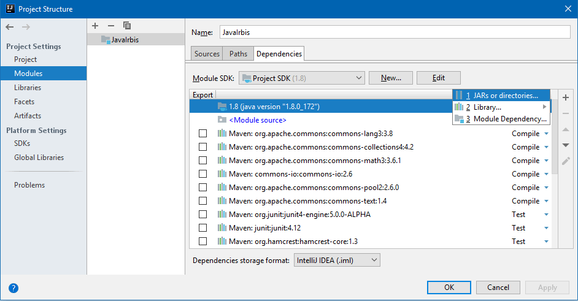
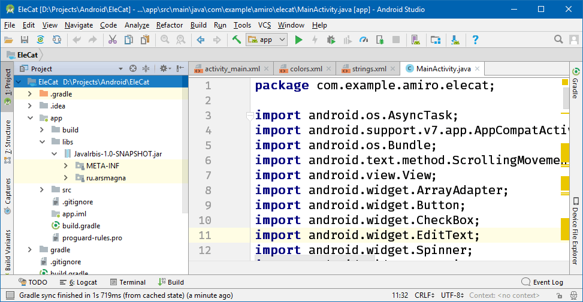
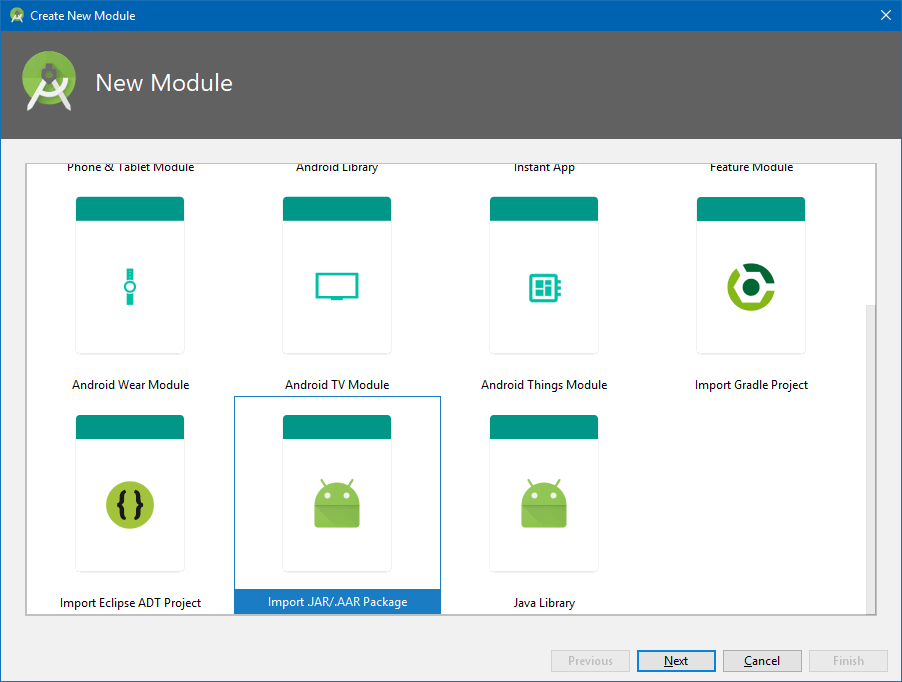

### Добавление JAR-файла в проект

#### IDEA

Чтобы добавить в проект библиотеку в виде JAR-файла, нужно:

1. Выбрать пункт меню `File -> Project Structure (Ctrl+Alt+Shift+S)`.
2. Выбрать на левой панели `Modules`.
3. Перейти на закладку `Dependencies`.
4. Нажать кнопку `+` и в выпадающем меню выбрать нужный JAR-файл или директорию с CLASS-файлами

#### Android Studio

Можно как в IDEA, а можно и так:

1. Переключить дерево проекта в режим `Project`.
2. Скопировать JAR-файл в папку `app/libs` (можно с помощью пункта контекстного меню `Paste`).
3. Щелкнуть правой кнопкой мыши по скопированному JAR-файлу и выбрать пункт меню `Add As Library...`.
4. Можно сходить в скрипты Gradle и убедиться, что библиотека успешно добавлена.

Ещё способ:

1. `File -> New -> New Module`.
2. Следовать указаниям мастера.
3. По окончании работы мастера зайти в `File -> Project Structure (Ctrl+Alt+Shift+S)`, выбрать на левой панели `Modules`, перейти на вкладку `Dependencies`, нажать кнопку `+` и в выпадающем меню выбрать `Module Dependency`. 

