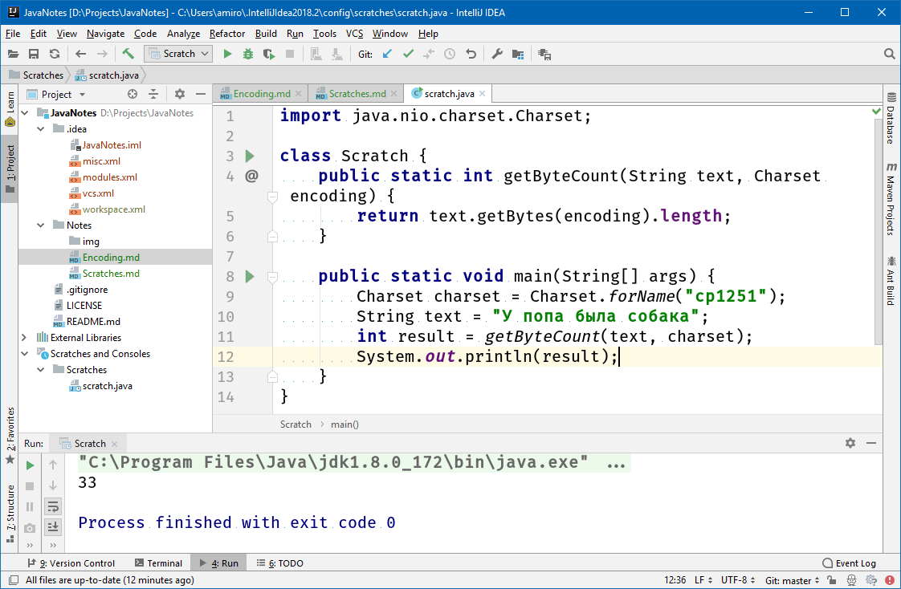
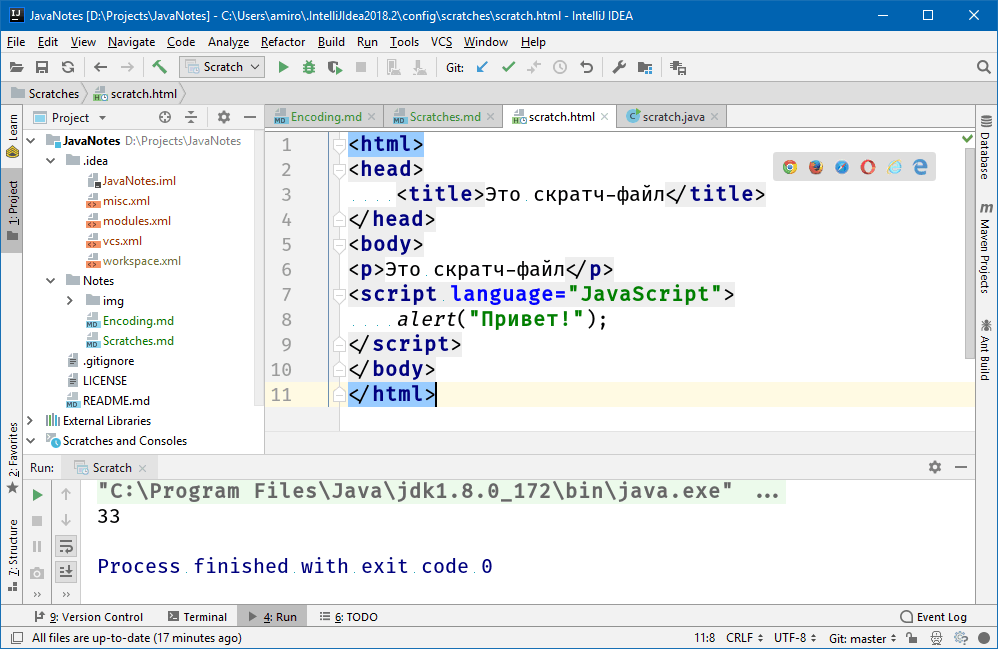

### Скратч-файлы

В IDEA поддерживаются так называемые скратч-файлы, в которых можно проводить различные эксперименты над собственным кодом (не обязательно тесты!):

Кроме подсветки синтаксиса и подсказок Intellisense доступны запуск и отладка (см. зеленые треугольники слева от кода).

Скратч-файл может быть на любом из языков, поддерживаемых IDEA, даже на HTML/CSS/JavaScript.

Обратите внимание на значки браузеров - IDEA позволяет тут же запустить HTML в браузере.

Скратч-файлы не компилируются вместе с проектом, поэтому в них можно писать любую ересь, в результирующий jar-файл она не попадет. :)
