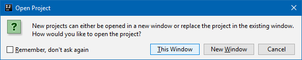

### Два и более проекта в IDEA

Можно загрузить в IDEA второй, третий и т. д. проект, просто выбрав пункт меню `File -> Open`. IDEA спросит, открыть ли проект в текущем или в новом окне:

Собственно, это все, дальше можно работать с обоими проектами независимо, просто переключаясь между окнами.